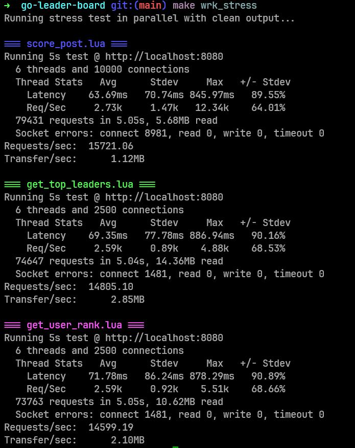

# Go Leaderboard Service

A high-performance, real-time leaderboard service built with Go, featuring Kafka-based message queuing, PostgreSQL persistence, and in-memory caching for optimal read/write performance.

## Performance Metrics

Our service delivers exceptional performance under load:

This test running 2 read and 1 write api concurrently and was performed running the wrk locally and everything else in docker.



**Single Instance Performance:**
- **Separate Operations**: ~25k+ writes/sec, ~30k+ reads/sec
- **Concurrent Operations**: ~15k+ writes/sec, ~13k+ reads/sec


## Architecture Overview

The service implements a hybrid architecture optimized for high-throughput scenarios:

### Core Components

- **Kafka Message Queue**: Handles ~5,000 Scores/message queue length for high-throughput asynchronous writes
- **PostgreSQL**: Primary persistent storage with optimized indexes
- **In-Memory Cache**: Skip list implementation for ultra-fast lookups and ranking operations
- **Real-time Updates**: Automatic cache synchronization with database changes

### Data Flow

**Write Operations**: Client → Kafka → PostgreSQL → In-Memory Cache Update

**Read Operations**: Client → In-Memory Cache (Skip List) → Response

## Prerequisites

### Production Deployment
- Docker & Docker Compose

### Local Development
- Go 1.24+
- Docker & Docker Compose
- wrk or k6 (for load testing)

## Quick Start

### 1. Clone and Configure

```bash
git clone https://github.com/iwhitebird/go-leader-board
cd go-leader-board
cp .env.example .env
# Configure .env according to your requirements
```

### 2. Running the service

Direct using docker (Recommended)

```bash
make prod_infra_up
```

#### Or

Running infra on docker and server Locally.

Start database and kafka:
```bash
make local_infra_up
```

Install dependencies and run:
```bash
go mod tidy #or go mod download
```
Optionally generate documentation

```bash
make swagger-docs
```

build and run the service 

```bash
make run # Or with ""air" if you have go-air installed
```

## API Reference

### Endpoints

| Method | Endpoint | Description | Complexity |
|--------|----------|-------------|------------|
| `POST` | `/api/leaderboard/score` | Submit player score | O(log n) |
| `GET` | `/api/leaderboard/top/{gameId}` | Get top players | O(k) |
| `GET` | `/api/leaderboard/rank/{gameId}/{userId}` | Get player rank | O(log n) |

### Query Parameters

The leaderboard endpoints support an optional `window` parameter:
- `24h` - Last 24 hours
- `3d` - Last 3 days  
- `7d` - Last 7 days
- Default: All time

### API Documentation

Interactive API documentation is available at `http://localhost:8080/swagger/index.html`

## Load Testing

### Using wrk

```bash
sudo apt-get install wrk parallel

# Combined read/write stress test
make wrk_stress

# Individual tests
make wrk_read_stress
make wrk_write_stress

#I have also provided the wrk docker for testing not recommended it uses docker internal gateway which is slow.
#make docker_wrk_stress:
#make docker_wrk_read_stress
#make docker_wrk_write_stress
```

## Technical Implementation


### Memory Usage Metrics

Our leaderboard service uses a hybrid storage approach with both in-memory skip lists and PostgreSQL persistence. Here's a detailed breakdown of memory consumption (Note : This estimates does not consider CPU alignment padding) :

#### Skip List Memory Analysis

**Per Score Entry in Skip List:**
```
SkipListNode Structure:
├── Key (int64)           : 8 bytes
├── Value (models.Score)  : 32 bytes
│   ├── GameID (int64)    : 8 bytes  
│   ├── UserID (int64)    : 8 bytes
│   ├── Score (uint64)    : 8 bytes
│   └── Timestamp (time.Time) : 8 bytes
├── Forward slice header  : 24 bytes
├── Forward pointers      : ~4.3 levels × 8 bytes = ~34 bytes (average)
├── Span slice header     : 24 bytes
└── Span counts           : ~4.3 levels × 4 bytes = ~17 bytes (average)

Total per node: ~139 bytes
```

**Skip List Overhead:**
```
SkipList Structure:
├── Mutex (sync.RWMutex) : 24 bytes
├── Length (int)         : 8 bytes  
├── Level (int)          : 8 bytes
├── Rand (*rand.Rand)    : 8 bytes (pointer)
├── Header node          : ~1,634 bytes (128 max levels × (8+4) + base + headers)
├── MapIndex overhead    : ~24 bytes per entry (map structure)
└── Compare function     : 8 bytes (pointer)

Base overhead: ~1,714 bytes per skip list
Map overhead: ~24 bytes per entry
```

**Memory Per Game (4 Time Windows):**
```
GameLeaderboard Structure:
├── 4 × LeaderBoard      : 4 × 1,714 = 6,856 bytes base
├── 4 × Skip list nodes  : 4 × (139 + 24) × N = 652N bytes
└── Mutex overhead       : 4 × 24 = 96 bytes

Total per game: 6,952 + 652N bytes (where N = unique players)
```

#### Memory Usage Examples

| Players per Game | Memory per Game | Memory for 1M Players | Memory for 10M Players |
|------------------|-----------------|----------------------|------------------------|
| 1,000           | 659 KB          | 652 MB               | 6.52 GB               |
| 10,000          | 6.4 MB          | 6.52 GB              | 65.2 GB               |
| 100,000         | 64.7 MB         | 65.2 GB              | 652 GB                |
| 1,000,000       | 652 MB          | 652 GB               | 6.52 TB               |

#### PostgreSQL Storage Analysis

**Per Score Record in PostgreSQL:**
```
scores table row:
├── game_id (BIGINT)     : 8 bytes
├── user_id (BIGINT)     : 8 bytes  
├── score (BIGINT)       : 8 bytes
├── timestamp (TIMESTAMP): 8 bytes
├── Row header overhead  : ~24 bytes
└── Index overhead       : ~32 bytes (composite indexes)

Total per record: ~88 bytes
```

**PostgreSQL Storage Examples:**

| Total Scores | Disk Storage | Index Storage | Total Storage |
|--------------|--------------|---------------|---------------|
| 1 Million    | 88 MB        | 32 MB         | 120 MB        |
| 10 Million   | 880 MB       | 320 MB        | 1.2 GB        |


### Caching Strategy

The service uses a multi-level caching approach:

1. **Skip List with Span Counts**: O(log n) insertions, lookups, and rank queries
   - Enhanced skip list implementation with span information for true O(log n) rank calculations
   - Hash map indexing for O(1) key lookups
2. **Request Caching**: Reduces repeated query overhead
3. **Time-based Partitioning**: Separate skip lists for different time windows

### Data Consistency

- **Write Path**: Eventual consistency through Kafka
- **Durability**: PostgreSQL ensures data persistence
- **Availability**: On startup service fetches data from postgres and keeps re-create cache's parallely for faster performance.

### Optimizations

- **Batch Processing**: Kafka enables efficient batch writes
- **Connection Pooling**: We are using pool of connecitons for faster and parallel writes to database.
- **Channel Queuing**: Go channels buffer Kafka messages for improved throughput
- **Concurrent Processing**: Lock-free dirty-reads with minimal write contention
- **Index Optimization**: PostgreSQL indexes on frequently queried fields

## Future Enhancements & Notes

### Scalability Improvements
- **Load Balancer**: Consistent hashing for multi-node deployment
- **Stateless Design**: External cache service for stateless horizontal scaling
- **Database Sharding**: Sharding db with something like CockroachDB with game_id 
- **Kafka Partitioning**: Topic partitioning by game_id for reduced lock contention while writing to db and updating cache.

## Trade-offs and Design Decisions

1. **Eventual Consistency**: Prioritizes write performance over immediate consistency
2. **Memory Usage**: In-memory caching trades memory for read performance
3. **Dirty Reads**: Accepts potential read inconsistency for higher throughput
4. **Channel Buffering with batch writes to kafka**: Improves performance but introduces potential message loss risk
5. **Time Window Separation**: Multiple skip lists increase memory usage but improve query performance


## Architecture Limitations & Production Considerations

Here are some things that need attention to make this system truly production-ready.

### Current Scaling Challenges

Our architecture has a fundamental limitation - the in-memory cache makes horizontal scaling tricky. The obvious fix would be to separate the cache into its own service, making our app stateless and much easier to scale horizontally. This will add network overhead.

Alternatively, we could stick with the current approach but use a game_id-based load balancer so the same requests always hit the same servers. Not as scalable, but it could work for moderate loads. but this complicates our load balancer and doesn't scale well with consistant hashing.

### Kafka Optimization Opportunities

We should configure Kafka so that message batches (~5000 messages) contain scores for the same game_id. This would significantly speed up writes since we'd have better data locality.

### Database Considerations

Sharding the database by game_id using cockroachdb would increase our startup latences and eventual writes. or use write heavy databases with direct partitioning support like scylladb or cassandra.

### Time Window Data Management

There's an interesting challenge with our time-based windows. We store separate skip lists for different time ranges, but over time these will accumulate stale data that falls outside the window (except for the "all" case).

Our current structure looks like:
```
map[game_id] -> [all]  -> ['All Skiplist']
                [24h]  -> ['24h Skiplist'] 
                [72hr] -> ['72hr Skiplist']
```

The time-based lists are periodically cleaned up to remove expired entries.
